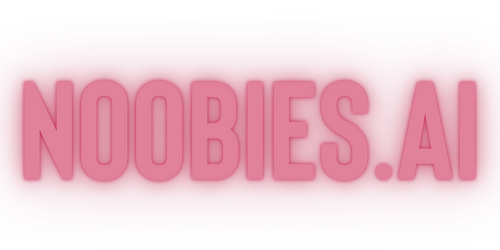

## 

# noobies.ai

[](https://clarifai.com/0aaryan/noobies/modules/content)
[](LICENSE)

## Description

**noobies.ai** is an open-source project designed to empower users in AI-driven content generation. It provides an extensive set of tools for creating diverse content, including blogs, images, videos, and audio. The project aims to simplify AI-based content creation while ensuring accessibility and user-friendliness.

## Features

### Blog Generation

The project includes a powerful blog generation module, allowing users to effortlessly create engaging written content.

```python
from noobies_ai.core import blog_generator

# Example usage
generated_blog = blog_generator.generate_blog(topic="AI in 2024")
```

### Video Generation

Generate dynamic video content with ease using the video generation module.

```python
from noobies_ai.core import video_generator

# Example usage
generated_video = video_generator.generate_video(topic="Future Technologies")
```

### AI Utilities

#### ImageAI

Harness the power of ImageAI to process and analyze images.

```python
from noobies_ai.core.utils.AI import imageAI

# Example usage
image_labels = imageAI.process_image("path/to/image.jpg")
```

#### TextAI

Generate AI-driven text content effortlessly.

```python
from noobies_ai.core.utils.AI import textAI

# Example usage
generated_text = textAI.generate_text(prompt="Describe a futuristic city.")
```

#### AudioAI

Explore the capabilities of AudioAI for audio-related tasks.

```python
from noobies_ai.core.utils.AI import audioAI

# Example usage
transcription = audioAI.transcribe_audio("path/to/audio.mp3")
```

### Content Conversion

Convert content seamlessly between different formats.

```python
from noobies_ai.core.utils.converter import blog_converter, image_converter, video_converter

# Example usage
converted_blog = blog_converter.convert_to_blog(generated_text)
converted_image = image_converter.convert_to_image(generated_blog)
converted_video = video_converter.convert_to_video(generated_text)
```

### Content Download

Download various types of content effortlessly.

```python
from noobies_ai.core.utils.downloader import audio_downloader, image_downloader, text_downloader, video_downloader

# Example usage
audio_downloader.download_audio("https://example.com/audio.mp3", destination="downloads/")
image_downloader.download_image("https://example.com/image.jpg", destination="downloads/")
text_downloader.download_text("https://example.com/text.txt", destination="downloads/")
video_downloader.download_video("https://example.com/video.mp4", destination="downloads/")
```

## Project Structure

## Project Structure

The project is organized into the following main components:

- **core**: Contains the core functionalities of the project.

  - **blog_generator.py**: Module for generating blog content.
  - **video_generator.py**: Module for generating video content.
  - **utils**: Utilities module containing AI-related tools.
    - **AI**: Submodule for AI functionalities.
      - **audioAI.py**: Module for handling audio AI.
      - **imageAI.py**: Module for handling image AI.
      - **textAI.py**: Module for handling text AI.
      - **videoAI.py**: Module for handling video AI.
      - **syntax**: Submodule for syntax-related tools.
        - **blog_syntax.py**: Module for blog syntax.
        - **video_syntax.py**: Module for video syntax.
      - **prompt**: Submodule for handling AI prompts.
        - **audio_prompts.py**: Module for audio prompts.
        - **image_prompts.py**: Module for image prompts.
        - **text_prompt.py**: Module for text prompts.
        - **video_prompt.py**: Module for video prompts.
    - **converter**: Submodule for converting content.
      - **blog_converter.py**: Module for converting blog content.
      - **image_converter.py**: Module for converting image content.
      - **video_converter.py**: Module for converting video content.
    - **downloader**: Submodule for downloading content.
      - **audio_downloader.py**: Module for downloading audio content.
      - **image_downloader.py**: Module for downloading image content.
      - **text_downloader.py**: Module for downloading text content.
      - **video_downloader.py**: Module for downloading video content.
    - **extractor**: Placeholder module for content extraction.

- **static**: Directory for static files, including images and logos.

- **pages**: Directory containing additional project pages.

- **app.py**: Main application script using Streamlit for the user interface.

## Streamlit Application

The primary interface for interacting with **noobies.ai** is a Streamlit web application. Follow these steps to run the application locally:

1. Install dependencies:

   ```bash
   pip install -r requirements.txt
   ```

2. Run the Streamlit app:

   ```bash
   streamlit run app.py
   ```

   This will launch the application in your default web browser.

3. Explore the Features:

   Navigate through the different sections of the application to explore and use the various content generation features. Interact with the intuitive user interface to leverage the power of AI in content creation.

   

## Usage Examples

### Blog Generation

```python
from noobies_ai.core import blog_generator

# Example usage
generated_blog = blog_generator.generate_blog(topic="AI in 2024")
```

[... Include similar example snippets for other features ...]

## Dependencies

Ensure you have the required dependencies installed by running:

```bash
pip install -r requirements.txt
```

## Badges

[... Include badges section as provided in the previous response ...]

## Contributing

We welcome contributions! Feel free to open issues, submit pull requests, or provide feedback.

## License

This project is licensed under the [MIT License](LICENSE).

---
